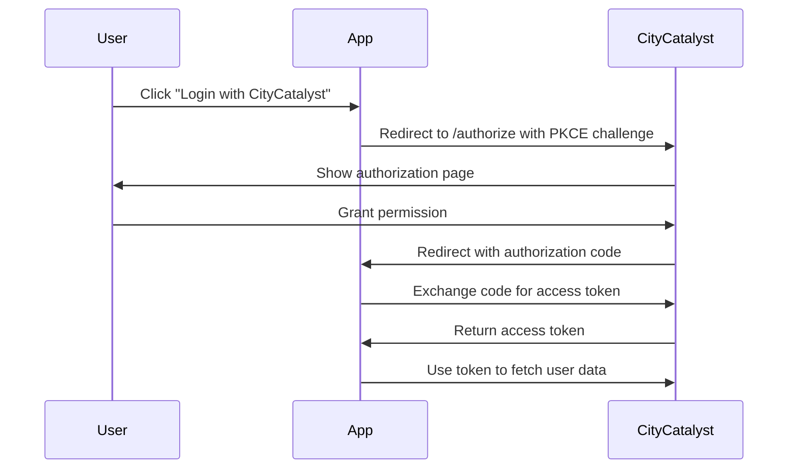

# CityCatalyst Template Integration Guide

A complete **proof-of-concept template** for building climate action applications that integrate with CityCatalyst's comprehensive data platform.

## Table of Contents

1. [Overview](#overview)
2. [Authentication Flow](#authentication-flow)
3. [API Endpoints](#api-endpoints)
4. [Data Schemas](#data-schemas)
5. [Implementation Examples](#implementation-examples)
6. [Complete Template Application](#complete-template-application)
7. [Environment Setup](#environment-setup)
8. [Deployment on Replit](#deployment-on-replit)

## Overview

This template demonstrates a **comprehensive CityCatalyst integration** designed for **remixing and adaptation** to specific climate action use cases.

### Template Capabilities
- ✅ **Authentication**: Secure OAuth 2.0 PKCE flow with CityCatalyst
- ✅ **Emissions Data**: Complete inventory display with GPC sector breakdowns
- ✅ **Risk Assessment**: CCRA dashboard with climate risk visualization  
- ✅ **Policy Actions**: HIAP recommendations for mitigation and adaptation
- ✅ **API Documentation**: Comprehensive guides for all CityCatalyst endpoints
- ✅ **Remix-Ready**: Modular architecture for easy customization to specific use cases

### How to Use This Template

1. **🔄 Remix** this project on Replit
2. **🎯 Define Your Use Case** (e.g., carbon tracking, risk analysis, policy planning)
3. **🔧 Adapt the Template** by removing unnecessary features and enhancing relevant ones
4. **🎨 Customize the UI** to match your specific requirements
5. **📋 Update Documentation** to reflect your new use case

💡 **Important**: When in doubt about CityCatalyst APIs or features, always check the official [CityCatalyst Documentation](https://citycatalyst.openearth.dev/docs/) for the most up-to-date information and best practices.

## Authentication Flow

### 1. OAuth 2.0 PKCE Flow



### 2. Required Environment Variables

```bash
OAUTH_CLIENT_ID=your_citycatalyst_client_id
OAUTH_REDIRECT_URI=https://your-app.replit.app/api/auth/oauth/callback
AUTH_BASE_URL=https://citycatalyst.openearth.dev
NODE_ENV=production
```

## API Endpoints

### Authentication Endpoints

#### Initiate OAuth Flow
```http
GET /api/auth/oauth/initiate
```

**Response:**
```json
{
  "authUrl": "https://citycatalyst.openearth.dev/authorize/?response_type=code&client_id=...",
  "state": "random_state_string"
}
```

#### OAuth Callback
```http
POST /api/auth/oauth/callback
Content-Type: application/json

{
  "code": "authorization_code_from_citycatalyst",
  "state": "state_from_initiate_response"
}
```

**Response:**
```json
{
  "user": {
    "id": "user_uuid",
    "email": "user@example.com",
    "name": "John Doe",
    "title": "Urban Planner",
    "projects": ["project_id_1", "project_id_2"]
  }
}
```

#### Logout
```http
POST /api/auth/logout
```

### User Profile Endpoint

#### Get User Profile
```http
GET /api/user/profile
Authorization: Bearer session_token
```

**Response:**
```json
{
  "user": {
    "id": "550e8400-e29b-41d4-a716-446655440000",
    "email": "elena.rodriguez@citycatalyst.org",
    "name": "Dr. Elena Rodriguez",
    "title": "Urban Planning Specialist",
    "projects": ["buenos-aires-2024", "montevideo-pilot"],
    "createdAt": "2024-01-15T10:30:00Z"
  }
}
```

### Cities Endpoint

#### Get User's Cities
```http
GET /api/cities
Authorization: Bearer session_token
```

**Response:**
```json
{
  "cities": [
    {
      "id": "city_uuid_1",
      "cityId": "buenos-aires",
      "name": "Buenos Aires",
      "country": "Argentina",
      "locode": "AR-BUE",
      "projectId": "buenos-aires-2024",
      "currentBoundary": {
        "type": "Feature",
        "geometry": {
          "type": "Polygon",
          "coordinates": [[[-58.5314, -34.7051], [-58.3314, -34.7051], ...]]
        },
        "properties": {
          "name": "Buenos Aires Administrative Boundary"
        }
      },
      "metadata": {
        "region": "Buenos Aires Province",
        "area": 203.0,
        "population": 3000000,
        "regionLocode": "AR-B",
        "countryLocode": "AR"
      },
      "createdAt": "2024-01-15T10:30:00Z"
    }
  ]
}
```

#### Get Single City
```http
GET /api/cities/{cityId}
Authorization: Bearer session_token
```

**Response:**
```json
{
  "city": {
    "id": "city_uuid_1",
    "cityId": "buenos-aires",
    "name": "Buenos Aires",
    "country": "Argentina",
    "locode": "AR-BUE",
    "projectId": "buenos-aires-2024",
    "currentBoundary": {
      "type": "Feature",
      "geometry": {
        "type": "Polygon",
        "coordinates": [[[-58.5314, -34.7051], [-58.3314, -34.7051], ...]]
      }
    },
    "metadata": {
      "region": "Buenos Aires Province",
      "area": 203.0
    },
    "createdAt": "2024-01-15T10:30:00Z"
  }
}
```

## Data Schemas

### User Schema

```typescript
interface User {
  id: string;                    // UUID
  email: string;                 // User's email address
  name: string;                  // Full name
  title?: string;                // Job title or role
  projects: string[];            // Array of project IDs user has access to
  createdAt: Date;              // Account creation timestamp
}
```

### City Schema

```typescript
interface City {
  id: string;                    // Internal UUID
  cityId: string;                // CityCatalyst city identifier
  name: string;                  // City name
  country: string;               // Country name
  locode?: string;               // UN/LOCODE identifier
  projectId: string;             // Associated project ID
  currentBoundary?: GeoJSON;     // Current selected boundary (GeoJSON)
  metadata: {                    // Additional city information
    region?: string;             // State/province/region
    area?: number;               // Area in km²
    population?: number;         // Population count
    regionLocode?: string;       // Region UN/LOCODE
    countryLocode?: string;      // Country UN/LOCODE
    [key: string]: any;          // Additional metadata
  };
  createdAt: Date;              // Record creation timestamp
}
```

### Authentication Response Schema

```typescript
interface LoginResponse {
  user: User;
}

interface OAuthResponse {
  authUrl: string;              // URL to redirect user for authentication
  state: string;                // State parameter for CSRF protection
}
```

## Implementation Examples

### Frontend Authentication Hook

```typescript
// hooks/useAuth.ts
import { useState, useEffect } from 'react';
import { apiRequest } from '@/lib/queryClient';

interface AuthState {
  user: User | null;
  isLoading: boolean;
  isAuthenticated: boolean;
}

export function useAuth() {
  const [authState, setAuthState] = useState<AuthState>({
    user: null,
    isLoading: true,
    isAuthenticated: false
  });

  useEffect(() => {
    checkAuthStatus();
  }, []);

  const checkAuthStatus = async () => {
    try {
      const response = await apiRequest('GET', '/api/user/profile');
      const data = await response.json();
      setAuthState({
        user: data.user,
        isLoading: false,
        isAuthenticated: true
      });
    } catch (error) {
      setAuthState({
        user: null,
        isLoading: false,
        isAuthenticated: false
      });
    }
  };

  const login = async () => {
    const response = await apiRequest('GET', '/api/auth/oauth/initiate');
    const data = await response.json();
    window.location.href = data.authUrl;
  };

  const logout = async () => {
    await apiRequest('POST', '/api/auth/logout');
    setAuthState({
      user: null,
      isLoading: false,
      isAuthenticated: false
    });
  };

  return {
    ...authState,
    login,
    logout,
    refetch: checkAuthStatus
  };
}
```

### Backend OAuth Service

```typescript
// services/authService.ts
import { randomBytes, createHash } from "crypto";

const CLIENT_ID = process.env.OAUTH_CLIENT_ID!;
const REDIRECT_URI = process.env.OAUTH_REDIRECT_URI!;
const AUTH_BASE_URL = process.env.AUTH_BASE_URL || "https://citycatalyst.openearth.dev";

function base64URLEncode(str: Buffer): string {
  return str.toString('base64')
    .replace(/\+/g, '-')
    .replace(/\//g, '_')
    .replace(/=/g, '');
}

function generateCodeVerifier(): string {
  return base64URLEncode(randomBytes(32));
}

function generateCodeChallenge(codeVerifier: string): string {
  return base64URLEncode(createHash('sha256').update(codeVerifier).digest());
}

export function generateOAuthState() {
  const codeVerifier = generateCodeVerifier();
  const codeChallenge = generateCodeChallenge(codeVerifier);
  const state = base64URLEncode(randomBytes(32));

  const params = new URLSearchParams({
    response_type: 'code',
    client_id: CLIENT_ID,
    redirect_uri: REDIRECT_URI,
    code_challenge: codeChallenge,
    code_challenge_method: 'S256',
    state,
    scope: 'read write',
  });

  const authUrl = `${AUTH_BASE_URL}/authorize/?${params.toString()}`;

  return { codeVerifier, codeChallenge, state, authUrl };
}

export async function exchangeCodeForToken(code: string, codeVerifier: string) {
  const tokenUrl = `${AUTH_BASE_URL}/api/v0/token/`;
  
  const body = new URLSearchParams({
    grant_type: 'authorization_code',
    client_id: CLIENT_ID,
    code,
    redirect_uri: REDIRECT_URI,
    code_verifier: codeVerifier,
  });

  const response = await fetch(tokenUrl, {
    method: 'POST',
    headers: { 'Content-Type': 'application/x-www-form-urlencoded' },
    body: body.toString(),
  });

  if (!response.ok) {
    const errorText = await response.text();
    throw new Error(`Token exchange failed: ${response.statusText} - ${errorText}`);
  }

  return await response.json();
}

export async function getUserProfile(accessToken: string) {
  const profileUrl = `${AUTH_BASE_URL}/api/v0/user/`;
  
  const response = await fetch(profileUrl, {
    headers: {
      'Authorization': `Bearer ${accessToken}`,
      'Accept': 'application/json',
    },
  });

  if (!response.ok) {
    throw new Error(`Failed to fetch profile: ${response.statusText}`);
  }

  const profileData = await response.json();
  return profileData.data || profileData;
}
```

## Complete Skeleton App

### 1. Package.json

```json
{
  "name": "citycatalyst-oauth-skeleton",
  "version": "1.0.0",
  "type": "module",
  "scripts": {
    "dev": "NODE_ENV=development tsx server/index.ts",
    "start": "NODE_ENV=production node dist/index.js",
    "build": "tsc && vite build"
  },
  "dependencies": {
    "express": "^4.18.2",
    "tsx": "^4.6.2",
    "drizzle-orm": "^0.29.0",
    "@libsql/client": "^0.4.0",
    "drizzle-kit": "^0.20.0"
  },
  "devDependencies": {
    "@types/express": "^4.17.21",
    "@types/node": "^20.10.0",
    "typescript": "^5.3.0",
    "vite": "^5.0.0"
  }
}
```

### 2. Server Entry Point

```typescript
// server/index.ts
import express from 'express';
import { storage } from './storage.js';
import { 
  generateOAuthState, 
  exchangeCodeForToken, 
  getUserProfile 
} from './services/authService.js';

const app = express();
app.use(express.json());

// OAuth initiation
app.get('/api/auth/oauth/initiate', async (req, res) => {
  try {
    const oauthState = generateOAuthState();
    
    // Store state and code verifier in session/database
    const sessionId = generateSessionToken();
    await storage.createSession({
      token: sessionId,
      state: oauthState.state,
      codeVerifier: oauthState.codeVerifier,
      expiresAt: new Date(Date.now() + 15 * 60 * 1000), // 15 minutes
    });

    res.cookie('session_id', sessionId, {
      httpOnly: true,
      secure: process.env.NODE_ENV === 'production',
      maxAge: 15 * 60 * 1000, // 15 minutes
    });

    res.json({
      authUrl: oauthState.authUrl,
      state: oauthState.state
    });
  } catch (error) {
    res.status(500).json({ error: 'Failed to initiate OAuth' });
  }
});

// OAuth callback
app.post('/api/auth/oauth/callback', async (req, res) => {
  try {
    const { code, state } = req.body;
    const sessionId = req.cookies.session_id;
    
    if (!sessionId) {
      return res.status(400).json({ error: 'No session found' });
    }

    const session = await storage.getSession(sessionId);
    if (!session || session.state !== state) {
      return res.status(400).json({ error: 'Invalid state parameter' });
    }

    // Exchange code for token
    const tokenResponse = await exchangeCodeForToken(code, session.codeVerifier);
    
    // Get user profile
    const userProfile = await getUserProfile(tokenResponse.access_token);
    
    // Create or update user
    const user = await storage.createOrUpdateUser({
      email: userProfile.email,
      name: userProfile.name,
      title: userProfile.title,
      projects: userProfile.projects || [],
      accessToken: tokenResponse.access_token,
      refreshToken: tokenResponse.refresh_token,
      tokenExpiry: new Date(Date.now() + tokenResponse.expires_in * 1000),
    });

    res.json({ user });
  } catch (error) {
    res.status(500).json({ error: 'Authentication failed' });
  }
});

// Get user profile
app.get('/api/user/profile', async (req, res) => {
  try {
    const sessionId = req.cookies.session_id;
    if (!sessionId) {
      return res.status(401).json({ error: 'Not authenticated' });
    }

    const session = await storage.getSession(sessionId);
    if (!session) {
      return res.status(401).json({ error: 'Session not found' });
    }

    const user = await storage.getUser(session.userId);
    if (!user) {
      return res.status(401).json({ error: 'User not found' });
    }

    res.json({ user });
  } catch (error) {
    res.status(500).json({ error: 'Failed to fetch profile' });
  }
});

// Get user cities
app.get('/api/cities', async (req, res) => {
  try {
    const sessionId = req.cookies.session_id;
    if (!sessionId) {
      return res.status(401).json({ error: 'Not authenticated' });
    }

    const session = await storage.getSession(sessionId);
    const user = await storage.getUser(session.userId);
    
    if (!user || !user.projects?.length) {
      return res.json({ cities: [] });
    }

    const cities = await storage.getCitiesByProjectIds(user.projects);
    res.json({ cities });
  } catch (error) {
    res.status(500).json({ error: 'Failed to fetch cities' });
  }
});

// Logout
app.post('/api/auth/logout', (req, res) => {
  res.clearCookie('session_id');
  res.json({ success: true });
});

const PORT = process.env.PORT || 5000;
app.listen(PORT, '0.0.0.0', () => {
  console.log(`Server running on port ${PORT}`);
});
```

### 3. React Components

```tsx
// components/ProfileCard.tsx
import React from 'react';
import { User } from '../types';

interface ProfileCardProps {
  user: User;
}

export function ProfileCard({ user }: ProfileCardProps) {
  return (
    <div className="bg-white rounded-lg shadow-md p-6">
      <h2 className="text-2xl font-bold mb-4">Profile Information</h2>
      <div className="space-y-3">
        <div>
          <label className="font-semibold text-gray-700">Name:</label>
          <p className="text-gray-900">{user.name}</p>
        </div>
        <div>
          <label className="font-semibold text-gray-700">Email:</label>
          <p className="text-gray-900">{user.email}</p>
        </div>
        <div>
          <label className="font-semibold text-gray-700">Title:</label>
          <p className="text-gray-900">{user.title || 'Not specified'}</p>
        </div>
        <div>
          <label className="font-semibold text-gray-700">User ID:</label>
          <p className="text-gray-900 font-mono text-sm">{user.id}</p>
        </div>
        <div>
          <label className="font-semibold text-gray-700">Projects:</label>
          <div className="flex flex-wrap gap-2 mt-1">
            {user.projects.map((project, index) => (
              <span 
                key={index}
                className="bg-blue-100 text-blue-800 px-2 py-1 rounded text-sm"
              >
                {project}
              </span>
            ))}
          </div>
        </div>
        <div>
          <label className="font-semibold text-gray-700">Member Since:</label>
          <p className="text-gray-900">
            {new Date(user.createdAt).toLocaleDateString()}
          </p>
        </div>
      </div>
    </div>
  );
}
```

```tsx
// components/CitiesSection.tsx
import React from 'react';
import { City } from '../types';

interface CitiesSectionProps {
  cities: City[];
}

export function CitiesSection({ cities }: CitiesSectionProps) {
  return (
    <div className="bg-white rounded-lg shadow-md p-6">
      <h2 className="text-2xl font-bold mb-4">Accessible Cities</h2>
      {cities.length === 0 ? (
        <p className="text-gray-500">No cities available</p>
      ) : (
        <div className="grid gap-4 md:grid-cols-2 lg:grid-cols-3">
          {cities.map((city) => (
            <div key={city.id} className="border rounded-lg p-4">
              <h3 className="font-bold text-lg">{city.name}</h3>
              <p className="text-gray-600">{city.country}</p>
              {city.locode && (
                <p className="text-sm text-gray-500">LOCODE: {city.locode}</p>
              )}
              <div className="mt-3 space-y-1">
                <p className="text-sm">
                  <span className="font-semibold">Project:</span> {city.projectId}
                </p>
                {city.metadata.region && (
                  <p className="text-sm">
                    <span className="font-semibold">Region:</span> {city.metadata.region}
                  </p>
                )}
                {city.metadata.area && (
                  <p className="text-sm">
                    <span className="font-semibold">Area:</span> {city.metadata.area} km²
                  </p>
                )}
                {city.metadata.population && (
                  <p className="text-sm">
                    <span className="font-semibold">Population:</span> {city.metadata.population.toLocaleString()}
                  </p>
                )}
              </div>
              <div className="mt-3 pt-3 border-t">
                <p className="text-xs text-gray-500">
                  Added: {new Date(city.createdAt).toLocaleDateString()}
                </p>
              </div>
            </div>
          ))}
        </div>
      )}
    </div>
  );
}
```

```tsx
// App.tsx
import React from 'react';
import { useAuth } from './hooks/useAuth';
import { useCities } from './hooks/useCities';
import { ProfileCard } from './components/ProfileCard';
import { CitiesSection } from './components/CitiesSection';

function App() {
  const { user, isLoading, isAuthenticated, login, logout } = useAuth();
  const { cities, isLoading: citiesLoading } = useCities();

  if (isLoading) {
    return (
      <div className="min-h-screen bg-gray-50 flex items-center justify-center">
        <div className="text-xl">Loading...</div>
      </div>
    );
  }

  if (!isAuthenticated) {
    return (
      <div className="min-h-screen bg-gray-50 flex items-center justify-center">
        <div className="bg-white p-8 rounded-lg shadow-md max-w-md w-full">
          <h1 className="text-2xl font-bold text-center mb-6">
            CityCatalyst OAuth Demo
          </h1>
          <button
            onClick={login}
            className="w-full bg-blue-600 text-white py-2 px-4 rounded hover:bg-blue-700"
          >
            Login with CityCatalyst
          </button>
        </div>
      </div>
    );
  }

  return (
    <div className="min-h-screen bg-gray-50">
      <header className="bg-white shadow">
        <div className="max-w-7xl mx-auto px-4 sm:px-6 lg:px-8">
          <div className="flex justify-between items-center py-6">
            <h1 className="text-3xl font-bold text-gray-900">
              CityCatalyst OAuth Demo
            </h1>
            <button
              onClick={logout}
              className="bg-red-600 text-white py-2 px-4 rounded hover:bg-red-700"
            >
              Logout
            </button>
          </div>
        </div>
      </header>

      <main className="max-w-7xl mx-auto py-6 sm:px-6 lg:px-8">
        <div className="px-4 py-6 sm:px-0">
          <div className="space-y-6">
            {user && <ProfileCard user={user} />}
            
            {citiesLoading ? (
              <div className="bg-white rounded-lg shadow-md p-6">
                <div className="text-center">Loading cities...</div>
              </div>
            ) : (
              <CitiesSection cities={cities} />
            )}
          </div>
        </div>
      </main>
    </div>
  );
}

export default App;
```

## Environment Setup

### 1. Create .env file

```bash
# OAuth Configuration
OAUTH_CLIENT_ID=your_citycatalyst_client_id
OAUTH_REDIRECT_URI=https://your-app-name.replit.app/api/auth/oauth/callback
AUTH_BASE_URL=https://citycatalyst.openearth.dev

# Application
NODE_ENV=production
PORT=5000

# Database (if using external database)
DATABASE_URL=your_database_url
```

### 2. Replit Secrets Configuration

In your Replit project, go to the Secrets tab and add:

- `OAUTH_CLIENT_ID`: Your CityCatalyst OAuth client ID
- `OAUTH_REDIRECT_URI`: Your app's callback URL
- `AUTH_BASE_URL`: CityCatalyst base URL (usually https://citycatalyst.openearth.dev)

## Deployment on Replit

### 1. Project Structure

Create a new Replit project with the following structure:

```
/
├── server/
│   ├── index.ts
│   ├── storage.ts
│   └── services/
│       └── authService.ts
├── client/
│   ├── src/
│   │   ├── components/
│   │   ├── hooks/
│   │   └── App.tsx
│   └── index.html
├── shared/
│   └── types.ts
├── package.json
└── vite.config.ts
```

### 2. Run Configuration

The app will automatically start on port 5000, which Replit forwards to your public URL.

### 3. Deployment Steps

1. Create new Replit project
2. Copy the skeleton code
3. Configure environment variables in Secrets
4. Register OAuth application with CityCatalyst
5. Update redirect URI in CityCatalyst OAuth settings
6. Run the application

### 4. OAuth Client Registration

Register your application with CityCatalyst:

1. **Application Name**: Your app name
2. **Redirect URI**: `https://your-app-name.replit.app/api/auth/oauth/callback`
3. **Scopes**: `read write`
4. **Grant Type**: `authorization_code`
5. **PKCE**: Required

## Error Handling

### Common Errors and Solutions

#### 1. "Single-use code" Error
**Cause**: Authorization code was already exchanged  
**Solution**: Implement code consumption tracking

```typescript
// Track consumed codes to prevent re-use
const consumedCodes = new Set<string>();

export async function exchangeCodeForToken(code: string, codeVerifier: string) {
  if (consumedCodes.has(code)) {
    throw new Error('Authorization code already used');
  }
  
  // ... exchange logic ...
  
  consumedCodes.add(code);
  return tokenResponse;
}
```

#### 2. Invalid State Parameter
**Cause**: CSRF protection failed  
**Solution**: Ensure state is properly stored and validated

#### 3. Token Expired
**Cause**: Access token expired  
**Solution**: Implement token refresh logic

```typescript
export async function refreshAccessToken(refreshToken: string) {
  const response = await fetch(`${AUTH_BASE_URL}/api/v0/token/`, {
    method: 'POST',
    headers: { 'Content-Type': 'application/x-www-form-urlencoded' },
    body: new URLSearchParams({
      grant_type: 'refresh_token',
      refresh_token: refreshToken,
      client_id: CLIENT_ID,
    }),
  });
  
  if (!response.ok) {
    throw new Error('Token refresh failed');
  }
  
  return await response.json();
}
```

## Testing

### Manual Testing Checklist

1. **Authentication Flow**
   - [ ] OAuth initiation redirects correctly
   - [ ] Authorization page loads
   - [ ] Callback processes successfully
   - [ ] User data is retrieved and displayed

2. **Profile Data**
   - [ ] All user fields are displayed
   - [ ] Projects array is properly formatted
   - [ ] Dates are correctly formatted

3. **Cities Data**
   - [ ] Cities list loads correctly
   - [ ] All city fields are displayed
   - [ ] Metadata is properly structured
   - [ ] Empty state handles gracefully

4. **Session Management**
   - [ ] Login/logout cycle works
   - [ ] Session persistence across page reloads
   - [ ] Session expiration handling

### Example Test Data

```json
{
  "user": {
    "id": "550e8400-e29b-41d4-a716-446655440000",
    "email": "test.user@citycatalyst.org",
    "name": "Test User",
    "title": "Test Engineer",
    "projects": ["test-project-1", "test-project-2"],
    "createdAt": "2024-01-15T10:30:00Z"
  },
  "cities": [
    {
      "id": "city_uuid_1",
      "cityId": "test-city",
      "name": "Test City",
      "country": "Test Country",
      "locode": "TC-TST",
      "projectId": "test-project-1",
      "metadata": {
        "region": "Test Region",
        "area": 100.5,
        "population": 500000
      },
      "createdAt": "2024-01-15T10:30:00Z"
    }
  ]
}
```

## Customization Guide

### Adding New Data Fields

1. **Update Schema Types**
```typescript
// shared/types.ts
interface User {
  // ... existing fields
  department?: string;  // New field
}
```

2. **Update API Response**
```typescript
// server/services/authService.ts
export async function getUserProfile(accessToken: string) {
  // ... existing logic
  return {
    // ... existing fields
    department: userData.department,
  };
}
```

3. **Update UI Components**
```tsx
// components/ProfileCard.tsx
<div>
  <label className="font-semibold text-gray-700">Department:</label>
  <p className="text-gray-900">{user.department || 'Not specified'}</p>
</div>
```

### Adding New API Endpoints

```typescript
// server/index.ts
app.get('/api/user/stats', async (req, res) => {
  try {
    const user = await getCurrentUser(req);
    const stats = await calculateUserStats(user);
    res.json({ stats });
  } catch (error) {
    res.status(500).json({ error: 'Failed to fetch stats' });
  }
});
```

This comprehensive guide provides everything needed to build applications that integrate with CityCatalyst's OAuth system and can be easily customized for specific use cases.
